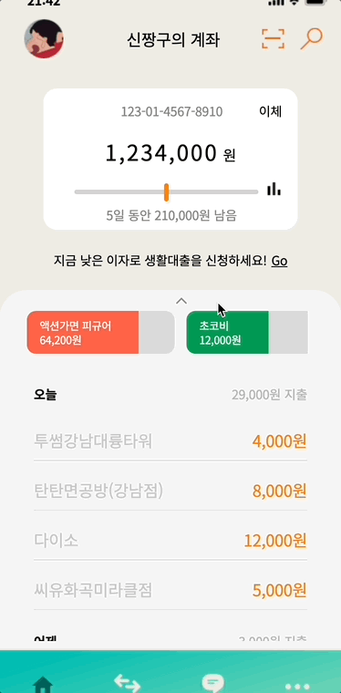
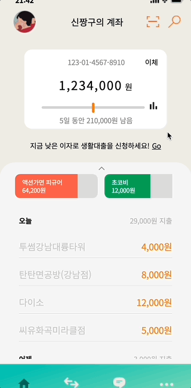

# 패스트캠퍼스 메가바이트스쿨 프론트엔드 개발자 과정 토이프로젝트
  바닐라 자바스크립트를 활용한 은행어플제작
## 1. Swiper로 슬라이드 만들기 
   
## 2. overflow scroll로 스크롤 & map()과 reduce() 활용해서 JSON파일 리스트로 만들기 
   
   
## 3. addEventListener와 translate, forEach로 토글 버튼 만들기 
   
## 4. Chartjs로 차트 페이지 만들기 & input 활용한 기준금액설정 기능 추가 
  

