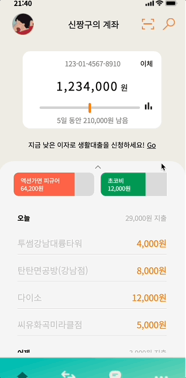

# FastCampus Megabyte School JS Toy Project
  바닐라 자바스크립트를 활용한 은행어플제작
  

   

  Megabyte School에서 그동안 배운 HTML/CSS/JS를 바탕으로 프로젝트를 개발했습니다.  

  프로젝트 시작 전 HTML/CSS 구조를 먼저 파악하고 나서 배치를 시작하였고, JavaScript로 UI의 동작과 JSON 파일의 데이터를 추출해 프로젝트를 구성했습니다.

## 1. Swiper로 슬라이드 만들기 
   
  Swiper를 이용해서 여러 통장 내역이 보일 수 있도록 구성했습니다.
## 2. JSON파일 리스트로 만들기 
   
    overflow scroll로 스크롤을 만들어 결제 내역을 볼 수 있게 했습니다. 
    또한 `fetch()`를 사용해 데이터를 가져와 `map()`과 `reduce()`로 결제내역을 만들었습니다.  
## 3. 토글 버튼 만들기 
   
  `addEventListener()`와 `forEach()`를 사용해서 화살표 토글을 클릭했을 경우 결제 내역이 상단으로 나올 수 있도록 설정했습니다. 
  `forEach()`를 사용한 것은 다른 통장 내역에서도 토글 기능이 활성화 되기 위함입니다. 
## 4. Chartjs로 차트 페이지 만들기 & input 활용한 기준금액설정 기능 추가 
   
  chart.js로 임의의 데이터로 차트를 설정했습니다. 
  input의 thumb을 동작 시키면 그에 따라 input의 value 값이 변동되는 기능 또한 추가했습니다.  
